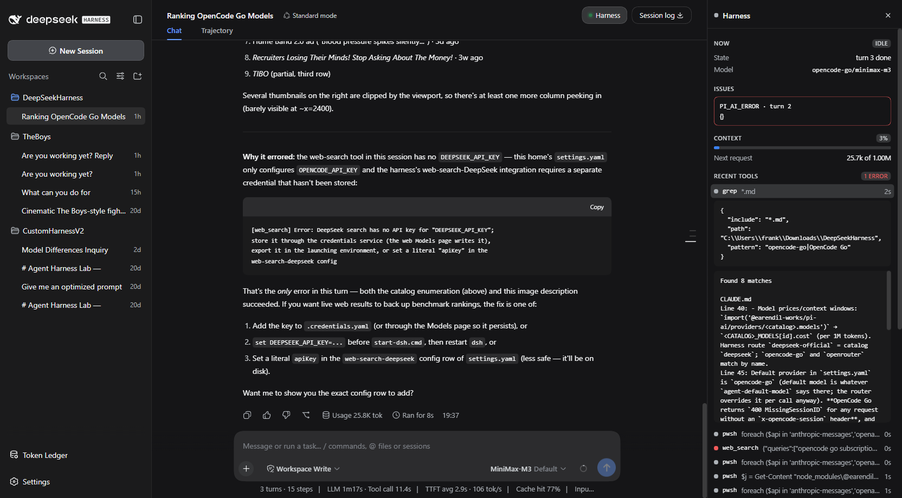
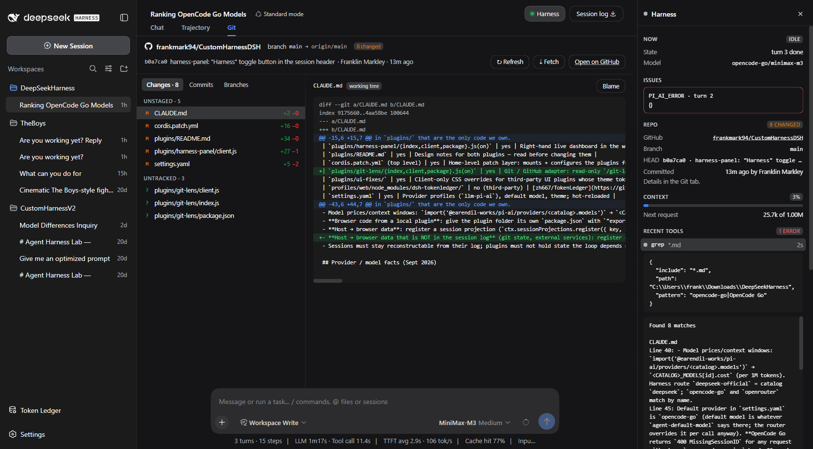
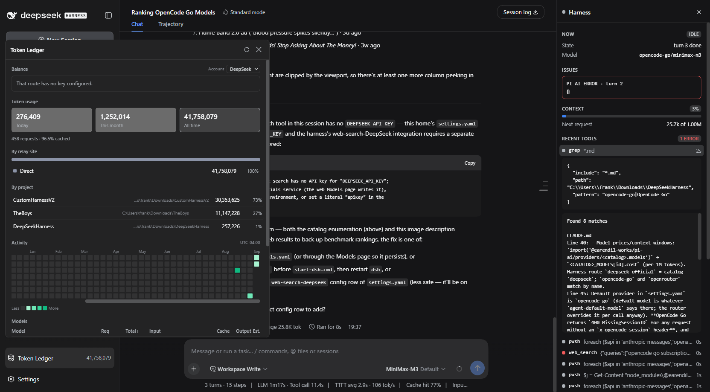
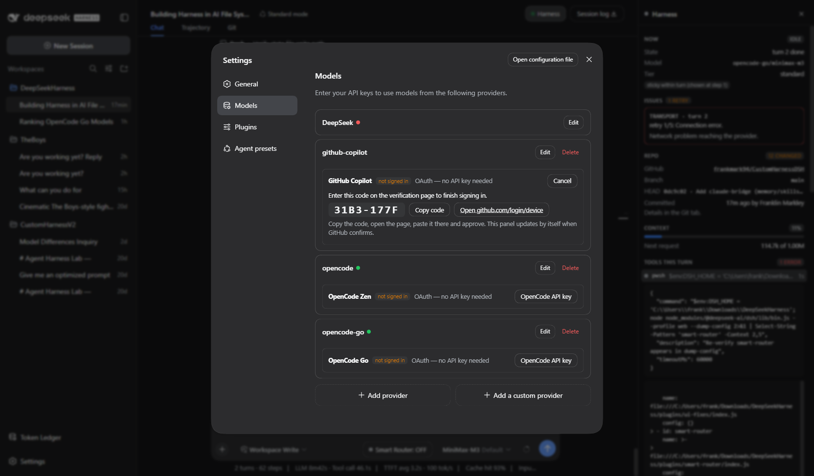

<h1 align="center">CustomHarnessDSH</h1>

<p align="center">
  A <a href="https://github.com/deepseek-ai/deepseek-harness">DeepSeek Harness</a> home directory, extended with a set of local plugins:
  smart model routing, live cost accounting, a right-hand dashboard, a Git tab, Claude Code memory,
  cross-agent session search — and GitHub Copilot sign-in by OAuth instead of an API key.
</p>

<p align="center">
  <a href="#quick-start"></a>
  <a href="#quick-start"></a>
  <a href="#the-plugins"></a>
  <a href="#github-copilot-by-oauth"></a>
  <a href="#secrets"></a>
</p>

<p align="center">
  <a href="#model-router"></a>
  <a href="#smart-router"></a>
  <a href="#token-ledger"></a>
  <a href="#harness-panel"></a>
  <a href="#git-lens"></a>
  <a href="#provider-login"></a>
  <a href="#claude-bridge"></a>
  <a href="#session-search"></a>
  <a href="#ui-fixes"></a>
</p>

<p align="center">
  
</p>

<p align="center"><sub>The <b>Harness</b> panel (right) while an agent works: state, last error with a hint, repo summary, tool timeline with an inspector, spend versus expected, and turn history. Toggle it with the <b>Harness</b> button in the header.</sub></p>

---

## What this is

This repo *is* `DSH_HOME` for a DeepSeek Harness install. The harness itself is an npm dependency
(`@deepseek-ai/dsh`, pinned in `package.json`); everything we own lives in `plugins/`, `vendor/`,
the home-level `cordis.patch.yml` that mounts it all, and `settings.yaml`. Sessions, storage,
profiles, credentials and the launcher with its API key stay untracked.

| Path | What it is |
|---|---|
| `plugins/<name>/` | Our plugins. Host half `index.js`; UI plugins add a hand-written `client.js` plus a `package.json` declaring `dsh.client` so the harness serves and hot-reloads it |
| `cordis.patch.yml` | Mounts and configures every plugin for every profile. Edits apply live |
| `settings.yaml` | Provider profiles (OpenCode Go / Zen, GitHub Copilot), default model, theme |
| `vendor/` | Third-party plugins vendored as their built `lib/`, with a `NOTICE` |
| `CLAUDE.md`, `plugins/README.md` | The design notes and the harness conventions learned the hard way. Read them before changing anything |

## Quick start

```bat
npm install                       :: installs the pinned harness into node_modules/
copy start-dsh.cmd.example start-dsh.cmd
:: put your OpenRouter key into start-dsh.cmd (it is git-ignored), then:
start-dsh.cmd                      :: DSH_HOME = this folder, web UI on http://127.0.0.1:3080
```

Then in the UI: Settings → Models → paste your OpenCode key on the `opencode-go` row, or press
**Sign in with GitHub** on the `github-copilot` row (see below). Optional third-party extras:

```bat
node node_modules/@deepseek-ai/dsh/lib/bin.js plugin --profile web add -w "github:zh667/TokenLedger"
```

Sanity check without booting:

```bat
node node_modules/@deepseek-ai/dsh/lib/bin.js --profile web --dump-config
```

Every plugin row should resolve to `file:///…/plugins/<name>/index.js`.

## The plugins

### model-router
Picks a **fast / standard / reasoning** model for every model call, per provider, from the prompt
(keywords, length, code blocks, question count) and the state of the turn (tool errors escalate).
Sticky within a turn so the prompt cache keeps working. Every decision is logged with its reasons
to `model-router/decisions.jsonl`; `/router status | on | off | pin <tier> | auto` in chat.
Registered with *prepend* on the `agent/request` waterfall, because the harness's own model
selection listener otherwise silently undoes the reroute after a live patch reload.

### smart-router
A **Smart Router: ON/OFF** pill at the bottom-right of the chatbox. When ON, the main agent becomes
capability-first (lower reasoning threshold, escalate on the first errored tool) while subagents
stay cost-first (keyword hits on short prompts are dampened, short prompts go fast). Persisted in
`smart-router/state.json`; `/smartrouter status | on | off`.

### token-ledger
Prices every request *before* it is sent (system prompt + tool schemas + messages, plus a
per-model expected-output allowance), then reconciles with the provider's reported usage. Running
totals per session, per model and per day, in tokens and USD. `/tokens`, `/tokens all`,
`/tokens last 10`, `/tokens reset`.

### harness-panel
The right-hand column, replacing the mostly empty Details panel: **Now** (state, elapsed, model,
router tier and reasons, running tool), **Issues** (last provider error, in plain words), **Repo**,
**Context** pressure, **Tools this turn** with an inspector, **Spend** (actual vs expected, cache
hit, today, all time, per model), **Plan** progress, **Turns**. Fed by a session projection that
folds the session log on the host and streams to the browser.

### git-lens
A **Git** tab beside Chat and Trajectory: GitHub repo link, branch → upstream, ↑ahead ↓behind, HEAD;
working tree with per-file diffs and blame; commits with stats and patches; branches and stashes;
Refresh, Fetch, Open on GitHub. Read-only loopback routes on the harness web server, gated by the
same signed browser-session cookie as the UI and restricted to registered workspaces.

<p align="center"></p>

### provider-login
OAuth sign-in for providers that ship a login flow. See [GitHub Copilot by OAuth](#github-copilot-by-oauth).

### claude-bridge
Injects Claude Code's memory **for the session's workspace** (`~/.claude/projects/<key>/memory`),
`~/.claude/CLAUDE.md` and a skills catalog into the system prompt. Adapted from
[YYTbit/dsh-plugin-claude-bridge](https://github.com/YYTbit/dsh-plugin-claude-bridge) (MIT), rewritten
because upstream keyed memory off the harness process directory with a wrong project-key encoding.
Everything it reads goes to the model provider; disable per workspace with `enableMemory: false`.

### session-search
[Tieboyh/dsh-session-search](https://github.com/Tieboyh/dsh-session-search) (BSD-3), vendored under
`vendor/`. Gives the agent `agent_session_search` and `agent_session_read`: an index-free,
read-only literal search over past dsh, Codex, Claude Code and OpenCode conversations on this machine.

### ui-fixes
Scoped CSS overrides for third-party UI whose theme tokens drifted from this harness build
(TokenLedger's popover painted itself with the scrim colour and came out translucent).

### Third-party plugins installed alongside

<p>
  <a href="https://github.com/bowenliang123/dsh-context"></a>
  <a href="https://github.com/NanmiCoder/dsh-agent-teams"></a>
  <a href="https://github.com/paradoxSCH/dsh-worktree"></a>
  <a href="https://github.com/omdsh-dev/DSH-better-sidebar"></a>
  <a href="https://github.com/yushuosun/dsh-cost-governor"></a>
  <a href="https://github.com/zh667/TokenLedger"></a>
</p>

| Plugin | What it adds | How it's installed |
|---|---|---|
| **dsh-context** | What the model is actually carrying in its context window: composition by source, estimates vs provider-reported usage, compactions, injections, model changes | web profile (npm) |
| **dsh-agent-teams** | A captain agent delegating to member agents with dependency-aware tasks, persistent state, messaging and a live UI | web profile (npm) |
| **dsh-worktree** | Durable Git worktrees per task (`.dsh-worktrees/` in the workspace) with a create → work → review → validate → apply → finish lifecycle, plus a `subagent_worktree` tool | web profile (npm) |
| **DSH-better-sidebar** | Right sidebar with file viewer/editor, terminal, side chat, Git and subagent tabs that other plugins can extend | web profile (npm) |
| **dsh-cost-governor** | Budget per period with warn and hard ratios feeding a policy on every model call; the bridge between the ledger and the router | vendored build under `vendor/` |
| **TokenLedger** | Usage by day, month, project, model and relay site, balances, exports | web profile (git) |

The exact install commands are in [README-SETUP.md](README-SETUP.md). They register in the web
profile, which is outside git, so a fresh clone re-runs them once.

### TokenLedger (third-party, installed into the web profile)
[zh667/TokenLedger](https://github.com/zh667/TokenLedger): usage by day, month, project, model and
relay site, with balances and exports. Installed with the harness's plugin command; not in git.

<p align="center"></p>

## GitHub Copilot by OAuth

The harness's pi-ai adapter registers GitHub's **device-code** flow for Copilot and can refresh the
token itself, but this web build never mounted the authorization service and no surface ever started
a flow — the Models page only offered an API-key box. This repo mounts the service and adds the
surface. On the `github-copilot` row in Settings → Models:

1. Press **Sign in with GitHub** (leave the Enterprise domain blank for github.com).
2. **Copy code**, press **Open github.com/login/device**, paste the code, approve.
3. The card flips to *signed in* on its own; press **Fetch available models** to load what your
   subscription exposes. The grant is stored by the harness's credentials service and refreshed
   automatically. `/login github-copilot` does the same from chat.

<p align="center"></p>

## Secrets

`start-dsh.cmd` (holds the OpenRouter key), `.credentials.yaml` (API keys and OAuth grants),
sessions, storage, profiles and every plugin's runtime output are git-ignored. `start-dsh.cmd.example`
is the template. A secrets scan runs before each push.

## Credits

Built on [DeepSeek Harness](https://github.com/deepseek-ai/deepseek-harness). Third-party plugins keep
their own licenses: TokenLedger (MIT), dsh-plugin-claude-bridge (MIT, adapted), dsh-session-search (BSD-3, vendored).
